# Energy Compliance Analyzer

This is a Next.js project to analyze the compliance of electrical power quality data based on the normative resolutions of ANEEL (Brazilian National Electrical Energy Agency). The application allows users to upload CSV files, identifies pertinent ANEEL resolutions, and generates a compliance report. Heavy data processing is performed by Firebase Functions, and an interactive chat interface allows the user to dialogue and refine the generated reports.

## Project Description

The Energy Compliance Analyzer simplifies compliance verification for the electrical sector, using an artificial intelligence (Genkit) agent pipeline to automate the analysis of power quality data against ANEEL regulations. The main processing occurs in Firebase Functions, and an interactive chat interface with an orchestrator agent allows the user to interact and refine the generated reports, with AI responses streamed in real-time.

## Core Components

- **Frontend:** Next.js, React, ShadCN UI, Tailwind CSS.
- **Backend (API & Triggers):** Next.js Server Actions (for frontend interactions, like the report chat, and for triggering background processes).
- **Background Processing:** Firebase Functions (Node.js, TypeScript) for data analysis and AI.
- **Artificial Intelligence:** Genkit & Google AI (Gemini) running in Firebase Functions (for the main analysis and report generation pipeline with specialist agents: Data Analyst, Engineer, Reporter, Reviewer) and in Next.js Server Actions (for the interactive chat orchestrator agent).
- **Database, Storage & Chat:** Firebase (Authentication, Firestore, Storage, Realtime Database for chat).
- **Hosting:** Firebase App Hosting for the Next.js application.

## Key Features

- Upload CSV files of power quality data.
- Analysis pipeline with Specialized AI Agents in Firebase Functions:
  - **Senior Data Analyst:** Preprocessing, initial analysis, suggestion of transformations and visualizations.
  - **Electrical Engineer (Implicit):** Identification of ANEEL resolutions and compliance analysis.
  - **Reporter (Implicit):** Initial structuring of the report.
  - **Reviewer:** Refinement, grammatical correction, and formatting of the report.
- Generation of structured compliance report (JSON and MDX).
- Interactive Chat Interface on the report page:
  - Allows the user to ask for clarifications, further details, and request changes to the report.
  - Uses an Orchestrator Agent (via Next.js Server Actions and Genkit) to mediate the interaction.
  - AI responses are streamed in real-time.
  - Persistent chat history via Firebase Realtime Database.
- Analysis management (viewing, deletion, tags).

## High-Level Architecture

```mermaid
graph TD
    subgraph "UserInteraction" ["User Interaction"]
        UI["fa:fa-desktop Frontend Next.js/React<br>(ShadCN, TailwindCSS)<br>Hosted on Firebase App Hosting"]
    end

    subgraph "BackendLogic" ["Backend (Next.js)"]
        ServerActions["fa:fa-cogs Next.js Server Actions<br>(Upload Trigger, Chat Orchestrator)"]
    end

    subgraph "FirebasePlatform" ["Firebase Platform"]
        Auth["fa:fa-key Firebase Authentication<br>(Google Sign-In)"]
        Firestore["fa:fa-database Firebase Firestore<br>(Analyses Metadata, Tags, Status, Structured Report)"]
        Storage["fa:fa-archive Firebase Storage<br>(Upload CSVs, MDX Reports)"]
        RTDB["fa:fa-comments Firebase Realtime Database<br>(Chat History)"]
        Functions["fa:fa-bolt Firebase Functions<br>(Heavy Processing, Main AI Pipeline)"]
    end

    subgraph "GenAIServices" ["Artificial Intelligence (Genkit & Gemini)"]
        AIEngineFunctions["fa:fa-brain AI Engine - Functions<br>(Pipeline: Data Analyst, Electrical Engineer, Reporter, Reviewer)"]
        AIEngineServerActions["fa:fa-brain AI Engine - Server Actions<br>(Interactive Chat Orchestrator Agent)"]
    end

    %% User Flows
    UI -- "Login via Google" --> Auth
    UI -- "Upload CSV<br>(Title, Description)" --> ServerActions
    ServerActions -- "Creates Initial Analysis Record<br>(Status: 'uploading')" --> Firestore
    ServerActions -- "Uploads CSV to Analysis Path" --> Storage
    ServerActions -- "Finalizes Analysis Record<br>(CSV URL, Status: 'summarizing_data')" --> Firestore

    %% Background Processing Flow (Triggered by Firestore update)
    Firestore -- "Trigger (onUpdate: status='summarizing_data')" --> Functions
    Functions -- "Reads CSV from Storage" --> Storage
    Functions -- "Executes AI Agent Pipeline" --> AIEngineFunctions
    AIEngineFunctions -- "Generates Structured Report (JSON)" --> Functions
    Functions -- "Saves Structured Report (JSON)" --> Firestore
    Functions -- "Converts Structured to MDX and Saves" --> Storage
    Functions -- "Updates Status/Progress to 'completed'" --> Firestore

    %% Report Viewing & Chat Flow
    UI -- "View Report (requests MDX)" --> ServerActions
    ServerActions -- "Reads MDX Path" --> Firestore
    ServerActions -- "Reads MDX Content" --> Storage
    Storage -- "Returns MDX Content" --> ServerActions
    ServerActions -- "Sends MDX to UI" --> UI
    UI -- "Sends Chat Message<br>(with report context)" --> ServerActions
    ServerActions -- "Interacts with AI Orchestrator Agent<br>(using structured report and MDX)" --> AIEngineServerActions
    AIEngineServerActions -- "AI Response / Suggested Modification to Structured Report (if any)" --> ServerActions
    ServerActions -- "Saves Chat Message (user and AI)" --> RTDB
    ServerActions -- "If Report Modified:<br>Updates Structured Report (JSON)" --> Firestore
    ServerActions -- "If Report Modified:<br>Generates and Saves new MDX" --> Storage
    RTDB -- "Syncs Chat in Real-Time with UI" --> UI
    Firestore -- "(Optional) Notifies UI of report changes via listener"--> UI

    %% Styling (optional, for clarity in renderers that support it)
    classDef userInteraction fill:#E6E6FA,stroke:#333,stroke-width:2px;
    classDef backendNextJs fill:#ADD8E6,stroke:#333,stroke-width:2px;
    classDef firebasePlatform fill:#FFFACD,stroke:#333,stroke-width:2px;
    classDef genAI fill:#98FB98,stroke:#333,stroke-width:2px;

    class UI userInteraction
    class ServerActions backendNextJs
    class Auth,Firestore,Storage,RTDB,Functions firebasePlatform
    class AIEngineFunctions,AIEngineServerActions genAI
    %% End of diagram
```



<p align="center" data-ai-hint="architecture diagram">Application Architecture Diagram</p>

## Running Locally

### Prerequisites

- Node.js (version 20 or higher)
- npm or yarn
- Firebase CLI installed (`npm install -g firebase-tools`)
- Firebase Project (`electric-magnitudes-analizer`) with Authentication, Firestore, Storage, and Realtime Database enabled.
- Google AI (Gemini) API Key.

### Setup

1.  **Clone the repository.**
2.  **Install Next.js dependencies:** `npm install`
3.  **Install Firebase Functions dependencies:** `cd functions && npm install && cd ..`
4.  **Configure environment variables:**
    Create a `.env` file in the project root. This file will be used for local development (including the Next.js development server and Firebase Emulators).

    ```env
    # Consolidated Firebase configuration for the Next.js client
    # MUST be a valid stringified JSON.
    NEXT_PUBLIC_FIREBASE_CONFIG='{"apiKey":"YOUR_FIREBASE_API_KEY","authDomain":"YOUR_FIREBASE_AUTH_DOMAIN","projectId":"electric-magnitudes-analizer","storageBucket":"YOUR_FIREBASE_STORAGE_BUCKET","messagingSenderId":"YOUR_FIREBASE_MESSAGING_SENDER_ID","appId":"YOUR_FIREBASE_APP_ID","measurementId":"YOUR_FIREBASE_MEASUREMENT_ID","databaseURL":"YOUR_DATABASE_URL"}'

    # Gemini API Key for Genkit flows in Next.js (Server Actions) and Firebase Functions (when emulated locally)
    # For deployed Firebase Functions, this key is configured as a secret in the deployment environment.
    NEXT_PUBLIC_GEMINI_API_KEY="YOUR_GEMINI_API_KEY"
    ```

    **Important:**

    - `NEXT_PUBLIC_FIREBASE_CONFIG`:
      - The value for `projectId` MUST be `electric-magnitudes-analizer`.
      - The value for `databaseURL` is essential for Realtime Database (chat), e.g.: `https://electric-magnitudes-analizer-default-rtdb.firebaseio.com`.
      - Ensure the entire value of this variable is a single, valid JSON string, enclosed in single or double quotes as per your shell/`.env` syntax.
    - `NEXT_PUBLIC_GEMINI_API_KEY`: Used by Genkit flows in both Next.js (for chat) and Firebase Functions (during local emulation).

5.  **Authorized Domains in Firebase Authentication:**
    In the Firebase Console (`electric-magnitudes-analizer` > Authentication > Settings > Authorized domains), add `localhost` and other development domains (e.g., `*.cloudworkstations.dev`).

6.  **Firebase Security Rules:**
    Review and, if necessary, deploy the security rules for Firestore (`rules/firestore.rules`), Storage (`rules/storage.rules`), and Realtime Database (`rules/database.rules.json`) before running locally or testing.
    Manual deployment (if not already done by CI/CD):
    `firebase deploy --only firestore,storage,database --project electric-magnitudes-analizer`

### Running the Application with Emulators (Recommended)

The project is configured to connect to Firebase Emulators (Auth, Firestore, Storage, Functions, Realtime Database) when accessed via `localhost`.

1.  **Build Firebase Functions (required for the Functions emulator):**
    ```bash
    npm run build --prefix functions
    ```
2.  **Start Firebase Emulators:**
    (In a separate terminal, in the project root)

    ```bash
    npm run emulators:start
    ```

    This uses `--import=./firebase-emulator-data --export-on-exit`. The Emulator UI will be at `http://localhost:4001`. Verify that `auth`, `firestore`, `storage`, `functions`, and `database` emulators are active.

3.  **Start your Next.js application:**
    (In another terminal)

    ```bash
    npm run dev
    ```

    Access your application (`http://localhost:9002`). `src/lib/firebase.ts` will connect to the emulators. The Next.js application will trigger the Functions (running in the emulator) through Firestore writes. The report's interactive chat interface interacts with Genkit flows via Next.js Server Actions, which will use the `NEXT_PUBLIC_GEMINI_API_KEY` from your `.env`.

4.  **(Alternative) Emulators and dev server together with `firebase emulators:exec`:**
    The `npm run emulators:dev` script is already configured for this (it builds the functions and then runs the Next.js dev server with the emulators).
    ```bash
    npm run emulators:dev
    ```
5.  **(Optional) Start the Genkit Development Server (to test flows in isolation):**
    If you want to test Genkit flows from the `src/ai/flows` folder in isolation, you can use:
    ```bash
    npm run genkit:dev
    ```
    This will start the Genkit development UI (usually at `http://localhost:4000/flows`).

## Testing

To run UI and integration tests (which use Firebase Emulators), execute:

```bash
npm test
```

This will use the `firebase emulators:exec --import=./firebase-emulator-data jest` script to run Jest tests in an environment with active emulators. Ensure that the functions have been built (`npm run build --prefix functions`) beforehand.

### Test Environment Setup for Jest (Local)

Jest tests require certain environment variables to be defined to interact correctly with Firebase Emulators and for Firebase initialization itself.
The required environment variables are the same as those used by the CI workflow in `.github/workflows/tests.yml`.

**Options for configuring environment variables for local Jest tests:**

1.  **`.env.test` File (Recommended if your Jest setup supports it):**
    Some Jest configurations (especially with `dotenv`) can automatically load a `.env.test` file. If so, create this file in the project root:

    ```env
    # .env.test
    # Consolidated Firebase configuration for tests (can use dummy values if actual calls are mocked)
    NEXT_PUBLIC_FIREBASE_CONFIG='{"apiKey":"test-api-key","authDomain":"localhost","projectId":"electric-magnitudes-analizer","storageBucket":"localhost","messagingSenderId":"test-sender-id","appId":"test-app-id","databaseURL":"http://localhost:9000/?ns=electric-magnitudes-analizer"}'
    NEXT_PUBLIC_GEMINI_API_KEY="test-gemini-key-for-jest"

    # Emulator settings (match firebase.json and what CI uses)
    FIRESTORE_EMULATOR_HOST="localhost:8080"
    FIREBASE_AUTH_EMULATOR_HOST="localhost:9099"
    FIREBASE_STORAGE_EMULATOR_HOST="localhost:9199" # Or 127.0.0.1:9199
    FIREBASE_DATABASE_EMULATOR_HOST="localhost:9000"
    FUNCTIONS_EMULATOR_HOST="localhost:5001"
    FIREBASE_FUNCTIONS_EMULATOR_ORIGIN="http://localhost:5001" # Or http://127.0.0.1:5001

    # Other variables that may be needed depending on tests
    GCLOUD_PROJECT="electric-magnitudes-analizer" # Same as NEXT_PUBLIC_FIREBASE_PROJECT_ID
    GCP_REGION="us-central1" # Default region for functions

    # FIREBASE_CONFIG is a JSON string used by firebase-admin in emulators.
    # The content of FIREBASE_CONFIG is typically {"databaseURL": "http://localhost:9000/?ns=PROJECT_ID", "storageBucket": "localhost", "projectId": "PROJECT_ID"}
    # But for functions emulators, Firebase CLI usually sets it automatically.
    # If you encounter issues, you might need to set it explicitly.
    # FIREBASE_CONFIG='{"projectId":"electric-magnitudes-analizer","databaseURL":"http://localhost:9000/?ns=electric-magnitudes-analizer","storageBucket":"localhost"}'
    ```

    _Note: The `jest.setup.js` in this project NO LONGER mocks `NEXT_PUBLIC_FIREBASE_CONFIG`. You MUST provide it through your environment._

2.  **Prefixing the test command:**
    You can define the variables directly in the command:

    ```bash
    NEXT_PUBLIC_FIREBASE_CONFIG='{...}' FIRESTORE_EMULATOR_HOST="localhost:8080" npm test
    ```

    (This can become verbose).

3.  **Shell/IDE Environment Configuration:**
    Export the variables in your terminal before running `npm test`, or configure them in your IDE's run configurations for Jest tests.

Refer to the `env:` section of the `test_production` job in `.github/workflows/tests.yml` for the complete list of environment variables that the CI environment uses and that you might need to replicate for consistent local testing.

## Deployment

This project is configured for deployment to **Firebase App Hosting** (for the Next.js application) and **Firebase Functions** (for backend processing). Security rules (Firestore, Storage, Realtime Database) are also deployed.

Consult the [**Deployment Guide**](docs/DEPLOYMENT.md) for details on manual and automated deployment via GitHub Actions.

## License

This project is licensed under the Apache License, Version 2.0. See the [LICENSE](LICENSE) file for more details.
