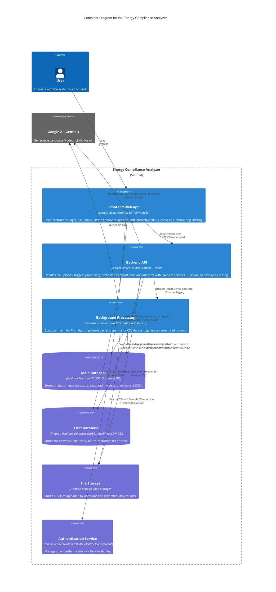

# C4 Model: Level 2 - Container Overview - Energy Compliance Analyzer

This diagram details the main containers (applications, data stores, etc.) that make up the Energy Compliance Analyzer system. Each container is a deployable unit or a significant data store.

## Container Details

Click on a container below for more details on its responsibilities, technologies, and interactions:

- [Frontend Web App](./frontend-app.md)
- [Backend API (Next.js Server Actions)](./server-actions.md)
- [Background Processing (Firebase Functions)](./firebase-functions.md)
- [Main Database (Firebase Firestore)](./firestore-db.md)
- [Chat Database (Firebase Realtime Database)](./rtdb.md)
- [File Storage (Firebase Storage)](./storage.md)
- [Authentication Service (Firebase Authentication)](./auth.md)

[<- Back to: System Context (C1)](../c1-context.md)
[Next Level: Component Diagram (C3)](../c3-components/index.md)
