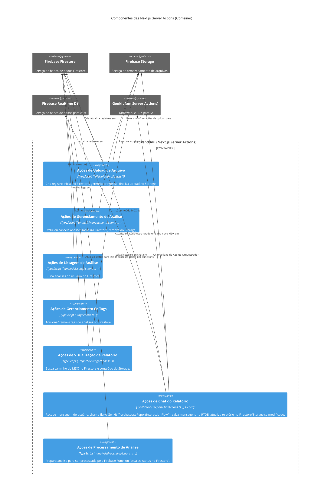

# C4 Model: Nível 3 - Componentes - Energy Compliance Analyzer

Este diagrama detalha os componentes internos de contêineres selecionados do Energy Compliance Analyzer.

## Contêiner: Frontend Web App (Next.js/React)

```mermaid
C4Component
  title Componentes do Frontend Web App (Contêiner)

  Container_Boundary(frontendContainer, "Frontend Web App") {
    Component(authUI, "Componentes de Autenticação", "React Components, Firebase SDK", "Interface para login/logout (AuthButton), exibição de perfil, utiliza AuthProvider.")
    Component(fileUploadUI, "Componentes de Upload", "React Components (NewAnalysisForm), ShadCN UI, useFileUploadManager Hook", "Formulário para seleção de arquivo CSV, título, descrição, e lógica de upload.")
    Component(analysisListUI, "Listagem de Análises", "React Components (Accordion), ShadCN UI", "Exibe análises passadas, com status e tags. Utiliza useAnalysisManager.")
    Component(analysisViewUI, "Visualização de Análise", "React Components (AnalysisView, AnalysisProgressDisplay, AnalysisResultsDisplay), ShadCN UI", "Mostra o progresso de análises em andamento e resultados de análises concluídas. Utiliza useAnalysisManager.")
    Component(reportViewUI, "Visualização de Relatório", "React Component (ReportPage), next-mdx-remote", "Renderiza o conteúdo do relatório MDX e a interface de chat.")
    Component(reportChatUI, "Interface de Chat do Relatório", "React Components, ShadCN UI, Firebase RTDB SDK", "Permite ao usuário interagir com o agente orquestrador sobre o relatório. Utiliza ReportPage.")
    Component(stateMgmt, "Gerenciamento de Estado e Lógica de UI", "React Contexts (AuthProvider), Custom Hooks (useAuth, useAnalysisManager, useFileUploadManager, useToast)", "Gerencia o estado da aplicação, autenticação, dados de análise e notificações.")
    Component(routing, "Roteamento", "Next.js App Router", "Gerencia a navegação entre páginas (Login, Home, Relatório).")
    Component(uiComponents, "Componentes de UI Reutilizáveis", "ShadCN UI, TailwindCSS", "Botões, Cards, Inputs, etc., usados em toda a aplicação.")
    Component(firebaseClient, "Cliente Firebase", "Firebase SDK (`firebase.ts`)", "Inicializa e configura o SDK do Firebase para o cliente.")
  }

  System_Ext(serverActions, "Next.js Server Actions", "Backend API para interações com dados e IA.")
  System_Ext(firebaseAuthExt, "Firebase Authentication", "Serviço de autenticação externo.")
  System_Ext(firebaseRtdbExt, "Firebase Realtime DB", "Serviço de banco de dados para chat.")

  Rel(authUI, firebaseAuthExt, "Usa para autenticar")
  Rel(authUI, stateMgmt, "Atualiza estado de autenticação")
  Rel(fileUploadUI, stateMgmt, "Usa/Atualiza estado de upload")
  Rel(fileUploadUI, serverActions, "Chama ações para criar registro e finalizar upload")
  Rel(analysisListUI, stateMgmt, "Usa estado de análises")
  Rel(analysisListUI, serverActions, "Chama ações para buscar/gerenciar análises")
  Rel(analysisViewUI, stateMgmt, "Usa estado da análise atual")
  Rel(reportViewUI, serverActions, "Chama ação para buscar relatório MDX")
  Rel(reportChatUI, serverActions, "Chama ação do orquestrador de chat")
  Rel(reportChatUI, firebaseRtdbExt, "Sincroniza mensagens de chat")
  Rel(routing, authUI, "Controla acesso baseado em autenticação")
  Rel(routing, reportViewUI, "Navega para")
  Rel(stateMgmt, firebaseClient, "Utiliza instância Firebase")
  Rel(uiComponents, "*", "Usado por diversos componentes de UI")

  UpdateElementStyle(authUI, $fontColor="white", $bgColor="rgb(68, 158, 228)", $borderColor="rgb(68, 158, 228)")
  UpdateElementStyle(fileUploadUI, $fontColor="white", $bgColor="rgb(68, 158, 228)", $borderColor="rgb(68, 158, 228)")
  UpdateElementStyle(analysisListUI, $fontColor="white", $bgColor="rgb(68, 158, 228)", $borderColor="rgb(68, 158, 228)")
  UpdateElementStyle(analysisViewUI, $fontColor="white", $bgColor="rgb(68, 158, 228)", $borderColor="rgb(68, 158, 228)")
  UpdateElementStyle(reportViewUI, $fontColor="white", $bgColor="rgb(68, 158, 228)", $borderColor="rgb(68, 158, 228)")
  UpdateElementStyle(reportChatUI, $fontColor="white", $bgColor="rgb(68, 158, 228)", $borderColor="rgb(68, 158, 228)")
  UpdateElementStyle(stateMgmt, $fontColor="black", $bgColor="rgb(200, 200, 200)", $borderColor="rgb(150,150,150)")
  UpdateElementStyle(routing, $fontColor="black", $bgColor="rgb(200, 200, 200)", $borderColor="rgb(150,150,150)")
  UpdateElementStyle(uiComponents, $fontColor="black", $bgColor="rgb(200, 200, 200)", $borderColor="rgb(150,150,150)")
  UpdateElementStyle(firebaseClient, $fontColor="black", $bgColor="rgb(200, 200, 200)", $borderColor="rgb(150,150,150)")
  UpdateElementStyle(serverActions, $fontColor="white", $bgColor="rgb(100, 100, 100)", $borderColor="rgb(100, 100, 100)")
  UpdateElementStyle(firebaseAuthExt, $fontColor="white", $bgColor="rgb(100, 100, 100)", $borderColor="rgb(100, 100, 100)")
  UpdateElementStyle(firebaseRtdbExt, $fontColor="white", $bgColor="rgb(100, 100, 100)", $borderColor="rgb(100, 100, 100)")

```

## Contêiner: Backend API (Next.js Server Actions)



## Contêiner: Processamento em Background (Firebase Functions)

```mermaid
C4Component
  title Componentes das Firebase Functions (Contêiner de Processamento em Background)

  System_Ext(firestoreExt, "Firebase Firestore", "Fonte de gatilhos (onUpdate) e armazenamento de dados (status, relatório estruturado)")
  System_Ext(storageExt, "Firebase Storage", "Armazenamento de arquivos CSV de entrada e relatórios MDX de saída")
  System_Ext(genkitFunc, "Genkit & Google AI", "Framework para IA e Modelos de Linguagem (Gemini) para processamento")

  Container_Boundary(functionsContainer, "Processamento em Background (Firebase Functions)") {
    Component(trigger, "Gatilho do Firestore (`processAnalysisOnUpdate`)", "Firebase Functions SDK (`functions/src/index.js`)", "Observa atualizações no Firestore (status='summarizing_data') para iniciar o processamento da análise.")
    Component(dataSummarizerAgent, "Agente: Analista de Dados (Sumarizador)", "Genkit Flow (`summarizePowerQualityDataFlow`), Gemini", "Lê CSV do Storage, pré-processa e sumariza dados do CSV em chunks. Utiliza `summarize-power-quality-data.ts`.")
    Component(regulationIdentifierAgent, "Agente: Identificador de Resoluções", "Genkit Flow (`identifyAEEEResolutionsFlow`), Gemini", "Identifica resoluções ANEEL pertinentes com base no sumário dos dados. Utiliza `identify-aneel-resolutions.ts`.")
    Component(complianceAnalyzerAgent, "Agente: Engenheiro de Conformidade (Relator Inicial)", "Genkit Flow (`analyzeComplianceReportFlow`), Gemini", "Gera o relatório estruturado (JSON) inicial de conformidade com base no sumário e nas resoluções. Utiliza `analyze-compliance-report.ts`.")
    Component(reportReviewerAgent, "Agente: Revisor de Relatório", "Genkit Flow (`reviewComplianceReportFlow`), Gemini", "Refina, corrige erros gramaticais e formata o relatório estruturado. Utiliza `review-compliance-report.ts`.")
    Component(mdxConverterUtil, "Utilitário de Conversão para MDX", "TypeScript (`reportUtils.ts`)", "Converte o relatório estruturado (JSON) final para formato MDX.")
    Component(statusUpdaterUtil, "Atualizador de Status/Progresso", "Firebase Admin SDK", "Atualiza o Firestore com o progresso da análise, status final (completed/error), e caminhos dos relatórios.")
    Component(gcsUtil, "Utilitário de Acesso ao Storage", "Firebase Admin SDK (`getFileContentFromStorage`)", "Responsável por ler o conteúdo do arquivo CSV do Firebase Storage.")
  }

  Rel(trigger, firestoreExt, "Acionado por atualizações em")
  Rel(trigger, processAnalysisFn, "Invoca a função principal de orquestração")

  Component(processAnalysisFn, "Orquestrador da Pipeline (`processAnalysis.js`)", "Firebase Functions SDK, TypeScript", "Orquestra a chamada sequencial dos agentes de IA e utilitários.")

  Rel(processAnalysisFn, gcsUtil, "Usa para ler CSV")
  Rel(gcsUtil, storageExt, "Lê arquivo de")
  Rel(processAnalysisFn, dataSummarizerAgent, "Chama (1)")
  Rel(dataSummarizerAgent, genkitFunc, "Usa")
  Rel(processAnalysisFn, regulationIdentifierAgent, "Chama (2) com sumário de (1)")
  Rel(regulationIdentifierAgent, genkitFunc, "Usa")
  Rel(processAnalysisFn, complianceAnalyzerAgent, "Chama (3) com sumário e resoluções")
  Rel(complianceAnalyzerAgent, genkitFunc, "Usa")
  Rel(processAnalysisFn, reportReviewerAgent, "Chama (4) com relatório de (3)")
  Rel(reportReviewerAgent, genkitFunc, "Usa")
  Rel(processAnalysisFn, mdxConverterUtil, "Chama (5) com relatório de (4)")
  Rel(mdxConverterUtil, storageExt, "Salva relatório MDX em")
  Rel(processAnalysisFn, statusUpdaterUtil, "Usa para atualizar progresso/status")
  Rel(statusUpdaterUtil, firestoreExt, "Atualiza dados em")


  UpdateElementStyle(trigger, $fontColor="white", $bgColor="rgb(68, 158, 228)", $borderColor="rgb(68, 158, 228)")
  UpdateElementStyle(processAnalysisFn, $fontColor="white", $bgColor="rgb(68, 158, 228)", $borderColor="rgb(68, 158, 228)")
  UpdateElementStyle(dataSummarizerAgent, $fontColor="white", $bgColor="rgb(68, 158, 228)", $borderColor="rgb(68, 158, 228)")
  UpdateElementStyle(regulationIdentifierAgent, $fontColor="white", $bgColor="rgb(68, 158, 228)", $borderColor="rgb(68, 158, 228)")
  UpdateElementStyle(complianceAnalyzerAgent, $fontColor="white", $bgColor="rgb(68, 158, 228)", $borderColor="rgb(68, 158, 228)")
  UpdateElementStyle(reportReviewerAgent, $fontColor="white", $bgColor="rgb(68, 158, 228)", $borderColor="rgb(68, 158, 228)")
  UpdateElementStyle(mdxConverterUtil, $fontColor="black", $bgColor="rgb(200, 200, 200)", $borderColor="rgb(150,150,150)")
  UpdateElementStyle(statusUpdaterUtil, $fontColor="black", $bgColor="rgb(200, 200, 200)", $borderColor="rgb(150,150,150)")
  UpdateElementStyle(gcsUtil, $fontColor="black", $bgColor="rgb(200, 200, 200)", $borderColor="rgb(150,150,150)")
  UpdateElementStyle(firestoreExt, $fontColor="white", $bgColor="rgb(100, 100, 100)", $borderColor="rgb(100, 100, 100)")
  UpdateElementStyle(storageExt, $fontColor="white", $bgColor="rgb(100, 100, 100)", $borderColor="rgb(100, 100, 100)")
  UpdateElementStyle(genkitFunc, $fontColor="white", $bgColor="rgb(100, 100, 100)", $borderColor="rgb(100, 100, 100)")

```



[Voltar para: Diagrama de Contêineres (C2)](./c2-containers.md)
[Próximo Nível: Diagrama de Código (C4 - Simplificado)](./c4-code.md)
