# C3: Frontend Web App Components (Container)

This diagram details the main components that make up the "Frontend Web App" container of the Energy Compliance Analyzer.

[<- Back to Component Overview (C3)](./index.md)
[<- Back to Container Overview (C2)](../c2-containers/index.md)

```mermaid
C4Component
  title "Frontend Web App Components"

  Container_Boundary(frontendContainer, "Frontend Web App") {
    %% Top Layer: User-facing Interaction & Routing
    Component(routing, "Routing", "Next.js App Router", "Manages navigation (Login, Home, Report).", $sprite="fa:fa-route")
    Component(authUI, "Authentication UI", "React Components, Firebase SDK", "Login/logout UI, profile display.", $sprite="fa:fa-sign-in-alt")
    Component(fileUploadUI, "Upload UI", "React Components, Hooks", "Form for CSV upload & metadata.", $sprite="fa:fa-upload")
    Component(analysisListUI, "Analysis Listing UI", "React Components", "Displays past analyses, status, tags.", $sprite="fa:fa-list-alt")
    Component(analysisViewUI, "Analysis View UI", "React Components", "Shows progress/results of an analysis.", $sprite="fa:fa-eye")
    Component(reportViewUI, "Report View UI", "React Component, MDX", "Renders MDX report & chat.", $sprite="fa:fa-file-alt")
    Component(reportChatUI, "Report Chat UI", "React Components, RTDB SDK", "User interaction with report agent.", $sprite="fa:fa-comments")

    %% Middle Layer: State Management & Core Logic
    Component(stateMgmt, "State & UI Logic", "Contexts, Custom Hooks", "Manages app state (auth, analysis data, notifications).", $sprite="fa:fa-project-diagram")

    %% Bottom Layer: Utilities & Generic Components
    Component(firebaseClient, "Firebase Client Config", "Firebase SDK (`firebase.ts`)", "Initializes client-side Firebase SDK.", $sprite="fa:fa-plug")
    Component(uiComponents, "Reusable UI Library", "ShadCN UI, TailwindCSS", "Buttons, Cards, Inputs, etc.", $sprite="fa:fa-puzzle-piece")
  }

  System_Ext(serverActions, "Next.js Server Actions", "Backend API for data/AI.", $sprite="fa:fa-cogs")
  System_Ext(firebaseAuthExt, "Firebase Authentication", "External auth service.", $sprite="fa:fa-key")
  System_Ext(firebaseRtdbExt, "Firebase Realtime DB", "DB service for chat.", $sprite="fa:fa-comments")

  %% Relationships - Grouped by source component or logical flow
  Rel(routing, authUI, "Controls access based on auth state")
  Rel(routing, reportViewUI, "Navigates to report page")

  Rel(authUI, firebaseAuthExt, "Authenticates user via")
  Rel(authUI, stateMgmt, "Updates/reflects auth state from")

  Rel(fileUploadUI, stateMgmt, "Uses/Updates upload state from")
  Rel(fileUploadUI, serverActions, "Calls actions for file record & finalization")

  Rel(analysisListUI, stateMgmt, "Uses analyses state from")
  Rel(analysisListUI, serverActions, "Calls actions to fetch/manage analyses")

  Rel(analysisViewUI, stateMgmt, "Uses current analysis state from")

  Rel(reportViewUI, serverActions, "Calls action to fetch MDX report")
  Rel(reportViewUI, reportChatUI, "Integrates Chat UI")

  Rel(reportChatUI, serverActions, "Calls chat orchestrator Server Action")
  Rel(reportChatUI, firebaseRtdbExt, "Syncs chat messages with")

  Rel(stateMgmt, firebaseClient, "Utilizes configured Firebase instance from")
  %% uiComponents are used by many UI components; relationship is implicit to reduce clutter.

  UpdateElementStyle(authUI, $fontColor="white", $bgColor="rgb(68, 158, 228)", $borderColor="rgb(68, 158, 228)")
  UpdateElementStyle(fileUploadUI, $fontColor="white", $bgColor="rgb(68, 158, 228)", $borderColor="rgb(68, 158, 228)")
  UpdateElementStyle(analysisListUI, $fontColor="white", $bgColor="rgb(68, 158, 228)", $borderColor="rgb(68, 158, 228)")
  UpdateElementStyle(analysisViewUI, $fontColor="white", $bgColor="rgb(68, 158, 228)", $borderColor="rgb(68, 158, 228)")
  UpdateElementStyle(reportViewUI, $fontColor="white", $bgColor="rgb(68, 158, 228)", $borderColor="rgb(68, 158, 228)")
  UpdateElementStyle(reportChatUI, $fontColor="white", $bgColor="rgb(68, 158, 228)", $borderColor="rgb(68, 158, 228)")
  UpdateElementStyle(stateMgmt, $fontColor="black", $bgColor="rgb(200, 200, 200)", $borderColor="rgb(150,150,150)")
  UpdateElementStyle(routing, $fontColor="black", $bgColor="rgb(200, 200, 200)", $borderColor="rgb(150,150,150)")
  UpdateElementStyle(uiComponents, $fontColor="black", $bgColor="rgb(200, 200, 200)", $borderColor="rgb(150,150,150)")
  UpdateElementStyle(firebaseClient, $fontColor="black", $bgColor="rgb(200, 200, 200)", $borderColor="rgb(150,150,150)")
  UpdateElementStyle(serverActions, $fontColor="white", $bgColor="rgb(100, 100, 100)", $borderColor="rgb(100, 100, 100)")
  UpdateElementStyle(firebaseAuthExt, $fontColor="white", $bgColor="rgb(100, 100, 100)", $borderColor="rgb(100, 100, 100)")
  UpdateElementStyle(firebaseRtdbExt, $fontColor="white", $bgColor="rgb(100, 100, 100)", $borderColor="rgb(100, 100, 100)")
```

## Frontend Component Details

The following is a list of the main components identified in the diagram above. Each component will have its own detail page (to be created).

- **Authentication UI (`authUI`)**:
  - [Details](./frontend/auth-ui.md)
- **Upload UI (`fileUploadUI`)**:
  - [Details](./frontend/file-upload-ui.md)
- **Analysis Listing UI (`analysisListUI`)**:
  - [Details](./frontend/analysis-list-ui.md)
- **Analysis View UI (`analysisViewUI`)**:
  - [Details](./frontend/analysis-view-ui.md)
- **Report View UI (`reportViewUI`)**:
  - [Details](./frontend/report-view-ui.md)
- **Report Chat UI (`reportChatUI`)**:
  - [Details](./frontend/report-chat-ui.md)
- **State & UI Logic (`stateMgmt`)**:
  - [Details](./frontend/state-mgmt.md)
- **Routing (`routing`)**:
  - [Details](./frontend/routing.md)
- **Reusable UI Library (`uiComponents`)**:
  - [Details](./frontend/ui-components.md)
- **Firebase Client Config (`firebaseClient`)**:
  - [Details](./frontend/firebase-client.md)

[Next: Server Actions Components](./02-server-actions-components.md)
