# C3: Next.js Server Actions Components (Container)

This diagram details the main components that make up the "Backend API (Next.js Server Actions)" container of the Energy Compliance Analyzer.

[<- Back to Component Overview (C3)](./index.md)
[<- Back to Container Overview (C2)](../c2-containers/index.md)

```mermaid
C4Component
  title "Next.js Server Actions Components"

  %% External Systems (Targets of actions)
  System_Ext(firestoreExt, "Firebase Firestore", "Firestore DB service", $sprite="fa:fa-database")
  System_Ext(storageExt, "Firebase Storage", "File storage service", $sprite="fa:fa-archive")
  System_Ext(rtdbExt, "Firebase Realtime DB", "Chat DB service", $sprite="fa:fa-comments")
  System_Ext(genkitSA, "Genkit (in Server Actions)", "AI Framework/SDK", $sprite="fa:fa-robot")

  Container_Boundary(serverActionsContainer, "Backend API (Next.js Server Actions)") {
    %% Grouped by general function area
    Component(fileUploadActions, "File Upload Actions", "TS (`fileUploadActions.ts`)", "Manages analysis record creation & upload finalization.", $sprite="fa:fa-file-upload")
    Component(analysisProcessingActions, "Analysis Processing Actions", "TS (`analysisProcessingActions.ts`)", "Updates Firestore status to trigger Function processing.", $sprite="fa:fa-cogs")
    Component(analysisMgmtActions, "Analysis Management Actions", "TS (`analysisManagementActions.ts`)", "Handles deletion/cancellation of analyses.", $sprite="fa:fa-tasks")
    Component(analysisListActions, "Analysis Listing Actions", "TS (`analysisListingActions.ts`)", "Fetches user's analyses from Firestore.", $sprite="fa:fa-history")
    Component(tagActions, "Tag Management Actions", "TS (`tagActions.ts`)", "Adds/Removes tags from analyses in Firestore.", $sprite="fa:fa-tags")
    Component(reportViewActions, "Report Viewing Actions", "TS (`reportViewingActions.ts`)", "Fetches MDX path from Firestore & content from Storage.", $sprite="fa:fa-file-invoice")
    Component(reportChatActions, "Report Chat Actions", "TS (`reportChatActions.ts`), Genkit", "Orchestrates report chat: calls Genkit, saves to RTDB, updates report.", $sprite="fa:fa-headset")
  }

  %% Relationships: grouped by action component
  Rel(fileUploadActions, firestoreExt, "Creates/Updates analysis records")

  Rel(analysisProcessingActions, firestoreExt, "Updates status to trigger Functions")

  Rel(analysisMgmtActions, firestoreExt, "Updates records (delete/cancel)")
  Rel(analysisMgmtActions, storageExt, "Removes files from Storage")

  Rel(analysisListActions, firestoreExt, "Reads analysis records")

  Rel(tagActions, firestoreExt, "Updates tags in analysis records")

  Rel(reportViewActions, firestoreExt, "Reads report metadata")
  Rel(reportViewActions, storageExt, "Reads MDX content")

  Rel(reportChatActions, rtdbExt, "Saves chat history")
  Rel(reportChatActions, firestoreExt, "Updates structured report (if AI modified)")
  Rel(reportChatActions, storageExt, "Saves new MDX (if AI modified)")
  Rel(reportChatActions, genkitSA, "Calls Chat Orchestrator Agent")

  UpdateElementStyle(fileUploadActions, $fontColor="white", $bgColor="rgb(68, 158, 228)", $borderColor="rgb(68, 158, 228)")
  UpdateElementStyle(analysisMgmtActions, $fontColor="white", $bgColor="rgb(68, 158, 228)", $borderColor="rgb(68, 158, 228)")
  UpdateElementStyle(analysisListActions, $fontColor="white", $bgColor="rgb(68, 158, 228)", $borderColor="rgb(68, 158, 228)")
  UpdateElementStyle(tagActions, $fontColor="white", $bgColor="rgb(68, 158, 228)", $borderColor="rgb(68, 158, 228)")
  UpdateElementStyle(reportViewActions, $fontColor="white", $bgColor="rgb(68, 158, 228)", $borderColor="rgb(68, 158, 228)")
  UpdateElementStyle(reportChatActions, $fontColor="white", $bgColor="rgb(68, 158, 228)", $borderColor="rgb(68, 158, 228)")
  UpdateElementStyle(analysisProcessingActions, $fontColor="white", $bgColor="rgb(68, 158, 228)", $borderColor="rgb(68, 158, 228)")
  UpdateElementStyle(firestoreExt, $fontColor="white", $bgColor="rgb(100, 100, 100)", $borderColor="rgb(100, 100, 100)")
  UpdateElementStyle(storageExt, $fontColor="white", $bgColor="rgb(100, 100, 100)", $borderColor="rgb(100, 100, 100)")
  UpdateElementStyle(rtdbExt, $fontColor="white", $bgColor="rgb(100, 100, 100)", $borderColor="rgb(100, 100, 100)")
  UpdateElementStyle(genkitSA, $fontColor="white", $bgColor="rgb(100, 100, 100)", $borderColor="rgb(100, 100, 100)")
```

## Server Actions Component Details

The following is a list of the main components (action modules) identified in the diagram above. Each will have its own detail page.

- **File Upload Actions (`fileUploadActions`)**:
  - [Details](./server-actions/file-upload-actions.md)
- **Analysis Management Actions (`analysisMgmtActions`)**:
  - [Details](./server-actions/analysis-mgmt-actions.md)
- **Analysis Listing Actions (`analysisListActions`)**:
  - [Details](./server-actions/analysis-list-actions.md)
- **Tag Management Actions (`tagActions`)**:
  - [Details](./server-actions/tag-actions.md)
- **Report Viewing Actions (`reportViewActions`)**:
  - [Details](./server-actions/report-view-actions.md)
- **Report Chat Actions (`reportChatActions`)**:
  - [Details](./server-actions/report-chat-actions.md)
- **Analysis Processing Actions (`analysisProcessingActions`)**:
  - [Details](./server-actions/analysis-processing-actions.md)

[Previous: Frontend Components](./01-frontend-app-components.md)
[Next: Firebase Functions Components](./03-firebase-functions-components.md)
