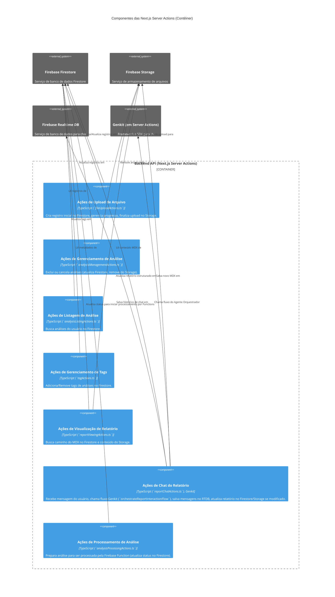

# C3: Componentes das Next.js Server Actions (Contêiner)

Este diagrama detalha os principais componentes que compõem o contêiner "Backend API (Next.js Server Actions)" do Energy Compliance Analyzer.

[<- Voltar para Visão Geral dos Componentes (C3)](./index.md)
[<- Voltar para Visão Geral dos Contêineres (C2)](../c2-containers/index.md)

## Detalhes dos Componentes das Server Actions

A seguir, uma lista dos principais componentes (módulos de actions) identificados no diagrama acima. Cada um terá sua própria página de detalhamento.

*   **Ações de Upload de Arquivo (`fileUploadActions`)**:
    *   [Detalhes](./server-actions/file-upload-actions.md)
*   **Ações de Gerenciamento de Análise (`analysisMgmtActions`)**:
    *   [Detalhes](./server-actions/analysis-mgmt-actions.md)
*   **Ações de Listagem de Análise (`analysisListActions`)**:
    *   [Detalhes](./server-actions/analysis-list-actions.md)
*   **Ações de Gerenciamento de Tags (`tagActions`)**:
    *   [Detalhes](./server-actions/tag-actions.md)
*   **Ações de Visualização de Relatório (`reportViewActions`)**:
    *   [Detalhes](./server-actions/report-view-actions.md)
*   **Ações de Chat do Relatório (`reportChatActions`)**:
    *   [Detalhes](./server-actions/report-chat-actions.md)
*   **Ações de Processamento de Análise (`analysisProcessingActions`)**:
    *   [Detalhes](./server-actions/analysis-processing-actions.md)

[Anterior: Componentes do Frontend](./01-frontend-app-components.md)
[Próximo: Componentes das Firebase Functions](./03-firebase-functions-components.md)
