# C3: Firebase Functions Components (Container)

This diagram details the main components that make up the "Background Processing (Firebase Functions)" container of the Energy Compliance Analyzer.

[<- Back to Component Overview (C3)](./index.md)
[<- Back to Container Overview (C2)](../c2-containers/index.md)

```mermaid
C4Component
  title "Firebase Functions Components (Background Processing)"

  %% External Systems
  System_Ext(firestoreExt, "Firebase Firestore", "Trigger source & data store", $sprite="fa:fa-database")
  System_Ext(storageExt, "Firebase Storage", "Storage for CSVs & MDX reports", $sprite="fa:fa-archive")
  System_Ext(genkitFunc, "Genkit & Google AI", "AI framework & LLMs", $sprite="fa:fa-robot")

  Container_Boundary(functionsContainer, "Background Processing (Firebase Functions)") {
    %% Pipeline Flow: Define in execution order for better visual flow
    Component(trigger, "Firestore Trigger", "Functions SDK", "Observes Firestore to start analysis.", $sprite="fa:fa-bell")
    Component(processAnalysisFn, "Pipeline Orchestrator", "Functions SDK, TS", "Coordinates AI agents & utilities.", $sprite="fa:fa-cogs")

    %% Utilities used by Orchestrator (can be defined after orchestrator)
    Component(gcsUtil, "Storage Access Util", "Admin SDK", "Reads CSV from Storage.", $sprite="fa:fa-download")
    Component(statusUpdaterUtil, "Status Updater Util", "Admin SDK", "Updates Firestore (progress/status).", $sprite="fa:fa-sync-alt")
    Component(mdxConverterUtil, "MDX Converter Util", "TS (`reportUtils.ts`)", "Converts JSON report to MDX.", $sprite="fa:fa-file-export")

    %% AI Agents (called by Orchestrator) - In pipeline sequence
    Component(dataSummarizerAgent, "Agent: Data Summarizer", "Genkit Flow, Gemini", "Summarizes CSV data.", $sprite="fa:fa-calculator")
    Component(regulationIdentifierAgent, "Agent: Resolution Identifier", "Genkit Flow, Gemini", "Identifies ANEEL resolutions.", $sprite="fa:fa-search")
    Component(complianceAnalyzerAgent, "Agent: Compliance Engineer", "Genkit Flow, Gemini", "Generates initial structured report.", $sprite="fa:fa-balance-scale")
    Component(reportReviewerAgent, "Agent: Report Reviewer", "Genkit Flow, Gemini", "Refines structured report.", $sprite="fa:fa-user-check")
  }

  %% Relationships - Defined to suggest pipeline flow
  Rel(trigger, processAnalysisFn, "Invokes")

  %% Orchestrator using utilities
  Rel(processAnalysisFn, gcsUtil, "Uses to read CSV")
  Rel(processAnalysisFn, statusUpdaterUtil, "Uses to update Firestore")
  Rel(processAnalysisFn, mdxConverterUtil, "Uses to convert report to MDX")

  %% Orchestrator calling AI Agents in sequence
  Rel(processAnalysisFn, dataSummarizerAgent, "1. Calls Data Summarizer")
  Rel(processAnalysisFn, regulationIdentifierAgent, "2. Calls Regulation Identifier")
  Rel(processAnalysisFn, complianceAnalyzerAgent, "3. Calls Compliance Engineer")
  Rel(processAnalysisFn, reportReviewerAgent, "4. Calls Report Reviewer")

  %% Agent interactions with Genkit/AI
  Rel(dataSummarizerAgent, genkitFunc, "Uses Genkit/AI")
  Rel(regulationIdentifierAgent, genkitFunc, "Uses Genkit/AI")
  Rel(complianceAnalyzerAgent, genkitFunc, "Uses Genkit/AI")
  Rel(reportReviewerAgent, genkitFunc, "Uses Genkit/AI")

  %% Utility interactions with external systems
  Rel(gcsUtil, storageExt, "Reads CSV from")
  Rel(statusUpdaterUtil, firestoreExt, "Updates status/report in")
  Rel(mdxConverterUtil, storageExt, "Saves MDX report to")


  UpdateElementStyle(trigger, $fontColor="white", $bgColor="rgb(68, 158, 228)", $borderColor="rgb(68, 158, 228)")
  UpdateElementStyle(processAnalysisFn, $fontColor="white", $bgColor="rgb(68, 158, 228)", $borderColor="rgb(68, 158, 228)")
  UpdateElementStyle(dataSummarizerAgent, $fontColor="white", $bgColor="rgb(68, 158, 228)", $borderColor="rgb(68, 158, 228)")
  UpdateElementStyle(regulationIdentifierAgent, $fontColor="white", $bgColor="rgb(68, 158, 228)", $borderColor="rgb(68, 158, 228)")
  UpdateElementStyle(complianceAnalyzerAgent, $fontColor="white", $bgColor="rgb(68, 158, 228)", $borderColor="rgb(68, 158, 228)")
  UpdateElementStyle(reportReviewerAgent, $fontColor="white", $bgColor="rgb(68, 158, 228)", $borderColor="rgb(68, 158, 228)")
  UpdateElementStyle(mdxConverterUtil, $fontColor="black", $bgColor="rgb(200, 200, 200)", $borderColor="rgb(150,150,150)")
  UpdateElementStyle(statusUpdaterUtil, $fontColor="black", $bgColor="rgb(200, 200, 200)", $borderColor="rgb(150,150,150)")
  UpdateElementStyle(gcsUtil, $fontColor="black", $bgColor="rgb(200, 200, 200)", $borderColor="rgb(150,150,150)")
  UpdateElementStyle(firestoreExt, $fontColor="white", $bgColor="rgb(100, 100, 100)", $borderColor="rgb(100, 100, 100)")
  UpdateElementStyle(storageExt, $fontColor="white", $bgColor="rgb(100, 100, 100)", $borderColor="rgb(100, 100, 100)")
  UpdateElementStyle(genkitFunc, $fontColor="white", $bgColor="rgb(100, 100, 100)", $borderColor="rgb(100, 100, 100)")
```

## Firebase Functions Component Details

The following is a list of the main components identified in the diagram. Each will have its own detail page.

- **Firestore Trigger (`trigger`)**:
  - [Details](./firebase-functions/trigger.md)
- **Agent: Data Analyst (Summarizer) (`dataSummarizerAgent`)**:
  - [Details](./firebase-functions/data-summarizer-agent.md)
- **Agent: Resolution Identifier (`regulationIdentifierAgent`)**:
  - [Details](./firebase-functions/regulation-identifier-agent.md)
- **Agent: Compliance Engineer (Initial Reporter) (`complianceAnalyzerAgent`)**:
  - [Details](./firebase-functions/compliance-analyzer-agent.md)
- **Agent: Report Reviewer (`reportReviewerAgent`)**:
  - [Details](./firebase-functions/report-reviewer-agent.md)
- **MDX Conversion Utility (`mdxConverterUtil`)**:
  - [Details](./firebase-functions/mdx-converter-util.md)
- **Status/Progress Updater (`statusUpdaterUtil`)**:
  - [Details](./firebase-functions/status-updater-util.md)
- **Storage Access Utility (`gcsUtil`)**:
  - [Details](./firebase-functions/gcs-util.md)
- **Pipeline Orchestrator (`processAnalysisFn`)**:
  - [Details](./firebase-functions/process-analysis-fn.md)

[Previous: Server Actions Components](./02-server-actions-components.md)
[Next: Code/Flow Diagram (C4)](../../c4-code/index.md)
