# C3: Componentes das Firebase Functions (Contêiner)

Este diagrama detalha os principais componentes que compõem o contêiner "Processamento em Background (Firebase Functions)" do Energy Compliance Analyzer.

[<- Voltar para Visão Geral dos Componentes (C3)](./index.md)
[<- Voltar para Visão Geral dos Contêineres (C2)](../c2-containers/index.md)

```mermaid
C4Component
  title Componentes das Firebase Functions (Contêiner de Processamento em Background)

  System_Ext(firestoreExt, "Firebase Firestore", "Fonte de gatilhos (onUpdate) e armazenamento de dados (status, relatório estruturado)", $sprite="fa:fa-database")
  System_Ext(storageExt, "Firebase Storage", "Armazenamento de arquivos CSV de entrada e relatórios MDX de saída", $sprite="fa:fa-archive")
  System_Ext(genkitFunc, "Genkit & Google AI", "Framework para IA e Modelos de Linguagem (Gemini) para processamento", $sprite="fa:fa-robot")

  Container_Boundary(functionsContainer, "Processamento em Background (Firebase Functions)") {
    Component(trigger, "Gatilho do Firestore (`processAnalysisOnUpdate`)", "Firebase Functions SDK (`functions/src/index.js`)", "Observa atualizações no Firestore (status='summarizing_data') para iniciar o processamento da análise.", $sprite="fa:fa-bell")
    Component(dataSummarizerAgent, "Agente: Analista de Dados (Sumarizador)", "Genkit Flow (`summarizePowerQualityDataFlow`), Gemini", "Lê CSV do Storage, pré-processa e sumariza dados do CSV em chunks. Utiliza `summarize-power-quality-data.ts`.", $sprite="fa:fa-calculator")
    Component(regulationIdentifierAgent, "Agente: Identificador de Resoluções", "Genkit Flow (`identifyAEEEResolutionsFlow`), Gemini", "Identifica resoluções ANEEL pertinentes com base no sumário dos dados. Utiliza `identify-aneel-resolutions.ts`.", $sprite="fa:fa-search")
    Component(complianceAnalyzerAgent, "Agente: Engenheiro de Conformidade (Relator Inicial)", "Genkit Flow (`analyzeComplianceReportFlow`), Gemini", "Gera o relatório estruturado (JSON) inicial de conformidade com base no sumário e nas resoluções. Utiliza `analyze-compliance-report.ts`.", $sprite="fa:fa-balance-scale")
    Component(reportReviewerAgent, "Agente: Revisor de Relatório", "Genkit Flow (`reviewComplianceReportFlow`), Gemini", "Refina, corrige erros gramaticais e formata o relatório estruturado. Utiliza `review-compliance-report.ts`.", $sprite="fa:fa-user-check")
    Component(mdxConverterUtil, "Utilitário de Conversão para MDX", "TypeScript (`reportUtils.ts`)", "Converte o relatório estruturado (JSON) final para formato MDX.", $sprite="fa:fa-file-export")
    Component(statusUpdaterUtil, "Atualizador de Status/Progresso", "Firebase Admin SDK", "Atualiza o Firestore com o progresso da análise, status final (completed/error), e caminhos dos relatórios.", $sprite="fa:fa-sync-alt")
    Component(gcsUtil, "Utilitário de Acesso ao Storage", "Firebase Admin SDK (`getFileContentFromStorage`)", "Responsável por ler o conteúdo do arquivo CSV do Firebase Storage.", $sprite="fa:fa-download")
    Component(processAnalysisFn, "Orquestrador da Pipeline (`processAnalysis.js`)", "Firebase Functions SDK, TypeScript", "Orquestra a chamada sequencial dos agentes de IA e utilitários.", $sprite="fa:fa-cogs")
  }

  Rel(trigger, firestoreExt, "Acionado por atualizações em")
  Rel(trigger, processAnalysisFn, "Invoca a função principal de orquestração")
  Rel(processAnalysisFn, gcsUtil, "Usa para ler CSV")
  Rel(gcsUtil, storageExt, "Lê arquivo de")
  Rel(processAnalysisFn, dataSummarizerAgent, "Chama (1)")
  Rel(dataSummarizerAgent, genkitFunc, "Usa")
  Rel(processAnalysisFn, regulationIdentifierAgent, "Chama (2) com sumário de (1)")
  Rel(regulationIdentifierAgent, genkitFunc, "Usa")
  Rel(processAnalysisFn, complianceAnalyzerAgent, "Chama (3) com sumário e resoluções")
  Rel(complianceAnalyzerAgent, genkitFunc, "Usa")
  Rel(processAnalysisFn, reportReviewerAgent, "Chama (4) com relatório de (3)")
  Rel(reportReviewerAgent, genkitFunc, "Usa")
  Rel(processAnalysisFn, mdxConverterUtil, "Chama (5) com relatório de (4)")
  Rel(mdxConverterUtil, storageExt, "Salva relatório MDX em")
  Rel(processAnalysisFn, statusUpdaterUtil, "Usa para atualizar progresso/status")
  Rel(statusUpdaterUtil, firestoreExt, "Atualiza dados em")


  UpdateElementStyle(trigger, $fontColor="white", $bgColor="rgb(68, 158, 228)", $borderColor="rgb(68, 158, 228)")
  UpdateElementStyle(processAnalysisFn, $fontColor="white", $bgColor="rgb(68, 158, 228)", $borderColor="rgb(68, 158, 228)")
  UpdateElementStyle(dataSummarizerAgent, $fontColor="white", $bgColor="rgb(68, 158, 228)", $borderColor="rgb(68, 158, 228)")
  UpdateElementStyle(regulationIdentifierAgent, $fontColor="white", $bgColor="rgb(68, 158, 228)", $borderColor="rgb(68, 158, 228)")
  UpdateElementStyle(complianceAnalyzerAgent, $fontColor="white", $bgColor="rgb(68, 158, 228)", $borderColor="rgb(68, 158, 228)")
  UpdateElementStyle(reportReviewerAgent, $fontColor="white", $bgColor="rgb(68, 158, 228)", $borderColor="rgb(68, 158, 228)")
  UpdateElementStyle(mdxConverterUtil, $fontColor="black", $bgColor="rgb(200, 200, 200)", $borderColor="rgb(150,150,150)")
  UpdateElementStyle(statusUpdaterUtil, $fontColor="black", $bgColor="rgb(200, 200, 200)", $borderColor="rgb(150,150,150)")
  UpdateElementStyle(gcsUtil, $fontColor="black", $bgColor="rgb(200, 200, 200)", $borderColor="rgb(150,150,150)")
  UpdateElementStyle(firestoreExt, $fontColor="white", $bgColor="rgb(100, 100, 100)", $borderColor="rgb(100, 100, 100)")
  UpdateElementStyle(storageExt, $fontColor="white", $bgColor="rgb(100, 100, 100)", $borderColor="rgb(100, 100, 100)")
  UpdateElementStyle(genkitFunc, $fontColor="white", $bgColor="rgb(100, 100, 100)", $borderColor="rgb(100, 100, 100)")
```

## Detalhes dos Componentes das Firebase Functions

A seguir, uma lista dos principais componentes identificados no diagrama. Cada um terá sua própria página de detalhamento (a ser criada).

*   **Gatilho do Firestore (`trigger`)**:
    *   [Detalhes](./firebase-functions/trigger.md) *(link a ser criado)*
*   **Agente: Analista de Dados (Sumarizador) (`dataSummarizerAgent`)**:
    *   [Detalhes](./firebase-functions/data-summarizer-agent.md) *(link a ser criado)*
*   **Agente: Identificador de Resoluções (`regulationIdentifierAgent`)**:
    *   [Detalhes](./firebase-functions/regulation-identifier-agent.md) *(link a ser criado)*
*   **Agente: Engenheiro de Conformidade (Relator Inicial) (`complianceAnalyzerAgent`)**:
    *   [Detalhes](./firebase-functions/compliance-analyzer-agent.md) *(link a ser criado)*
*   **Agente: Revisor de Relatório (`reportReviewerAgent`)**:
    *   [Detalhes](./firebase-functions/report-reviewer-agent.md) *(link a ser criado)*
*   **Utilitário de Conversão para MDX (`mdxConverterUtil`)**:
    *   [Detalhes](./firebase-functions/mdx-converter-util.md) *(link a ser criado)*
*   **Atualizador de Status/Progresso (`statusUpdaterUtil`)**:
    *   [Detalhes](./firebase-functions/status-updater-util.md) *(link a ser criado)*
*   **Utilitário de Acesso ao Storage (`gcsUtil`)**:
    *   [Detalhes](./firebase-functions/gcs-util.md) *(link a ser criado)*
*   **Orquestrador da Pipeline (`processAnalysisFn`)**:
    *   [Detalhes](./firebase-functions/process-analysis-fn.md) *(link a ser criado)*

[Anterior: Componentes das Server Actions](./02-server-actions-components.md)
