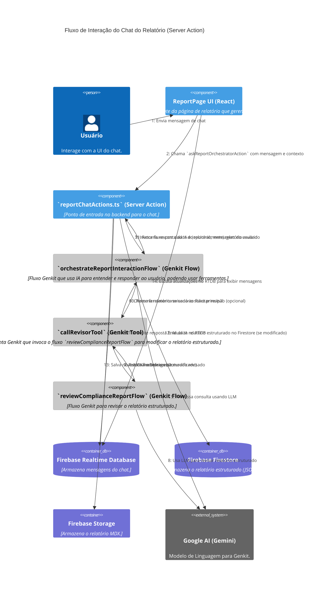
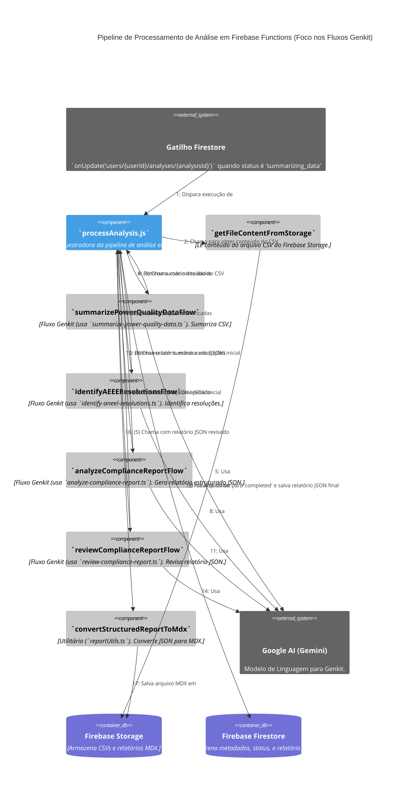

# C4 Model: Nível 4 - Código (Visão Simplificada) - Energy Compliance Analyzer

Este diagrama oferece uma visão simplificada de elementos de código chave, focando no fluxo de interação do chat do relatório e na pipeline de processamento de IA.
Por ser o nível mais granular, focaremos nos principais fluxos e interações entre os principais artefatos de código (arquivos/módulos e fluxos Genkit), em vez de classes ou funções individuais detalhadamente.

## Fluxo de Interação do Chat do Relatório (Orquestração via Server Action)

Este diagrama ilustra como uma mensagem do usuário na interface de chat do relatório é processada.

## Pipeline de Processamento de Análise (Firebase Functions)

Este diagrama ilustra a sequência de operações dentro da Firebase Function (`processAnalysisOnUpdate`) quando uma nova análise é disparada.

[Voltar para: Diagrama de Componentes (C3)](./c3-components.md)
