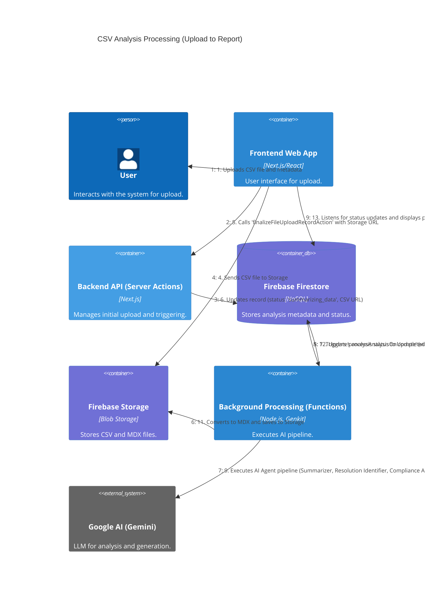

# C4 Dynamic Diagram: CSV Analysis Processing

[<- Back to Level C4 (Code)](./index.md)

This diagram illustrates the sequence of interactions and data flow when a user uploads a CSV file and the compliance analysis is processed by the AI pipeline in Firebase Functions.

## Flow Description

1.  The **User** interacts with the **Frontend Web App** to select a CSV file and provide metadata (title, description).
2.  The **Frontend Web App** calls Server Actions (`createInitialAnalysisRecordAction`) to register the analysis and manages the direct upload of the CSV file to Firebase Storage.
3.  The **Server Action** creates an initial record in **Firebase Firestore** with status "uploading".
4.  The **Frontend Web App** completes the CSV file upload to **Firebase Storage**.
5.  The **Frontend Web App** calls another Server Action (`finalizeFileUploadRecordAction`) with the file's Storage URL.
6.  The **Server Action** updates the analysis record in **Firebase Firestore**, changing the status to "summarizing_data" and saving the CSV URL.
7.  The status change in **Firebase Firestore** triggers the `processAnalysisOnUpdate` Firebase Function (container **Background Processing**).
8.  The **Firebase Function** reads the CSV file from **Firebase Storage**.
9.  The **Firebase Function** orchestrates the AI agent pipeline (using Genkit and **Google AI (Gemini)**) to:
    *   Summarize data.
    *   Identify ANEEL resolutions.
    *   Analyze compliance and generate an initial structured report (JSON).
    *   Review and refine the structured report.
10. The **Firebase Function** saves the final structured report (JSON) to **Firebase Firestore**.
11. The **Firebase Function** converts the JSON report to MDX and saves it to **Firebase Storage**.
12. The **Firebase Function** updates the analysis status in **Firebase Firestore** to "completed" and stores the MDX file path.
13. The **Frontend Web App** (via the `useAnalysisManager` hook using `onSnapshot`) detects status and progress updates in **Firebase Firestore** and displays the results or final report to the user.

This diagram focuses on the interaction between the main system containers during the processing of a new analysis.

    