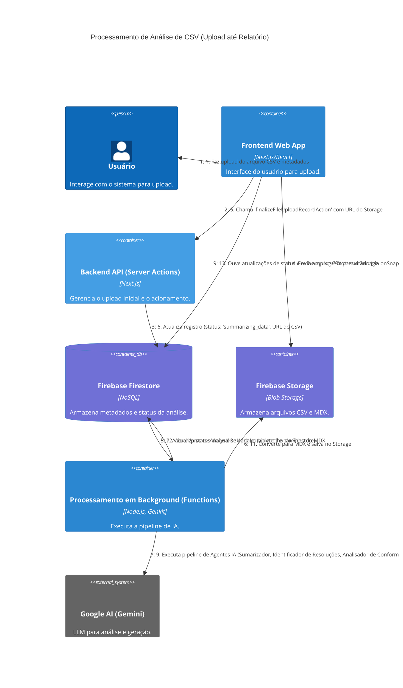

# C4 Dynamic Diagram: Processamento de Análise de CSV

[<- Voltar para Nível C4 (Código)](./index.md)

Este diagrama ilustra a sequência de interações e o fluxo de dados quando um usuário faz upload de um arquivo CSV e a análise de conformidade é processada pela pipeline de IA nas Firebase Functions.

## Descrição do Fluxo

1.  O **Usuário** interage com o **Frontend Web App** para selecionar um arquivo CSV e fornecer metadados (título, descrição).
2.  O **Frontend Web App** chama Server Actions (`createInitialAnalysisRecordAction`) para registrar a análise e gerencia o upload direto do arquivo CSV para o Firebase Storage.
3.  A **Server Action** cria um registro inicial no **Firebase Firestore** com o status "uploading".
4.  O **Frontend Web App** completa o upload do arquivo CSV para o **Firebase Storage**.
5.  O **Frontend Web App** chama outra Server Action (`finalizeFileUploadRecordAction`) com a URL do arquivo no Storage.
6.  A **Server Action** atualiza o registro da análise no **Firebase Firestore**, mudando o status para "summarizing_data" e salvando a URL do CSV.
7.  A mudança de status no **Firebase Firestore** aciona a Firebase Function `processAnalysisOnUpdate` (contêiner **Processamento em Background**).
8.  A **Firebase Function** lê o arquivo CSV do **Firebase Storage**.
9.  A **Firebase Function** orquestra a pipeline de agentes de IA (usando Genkit e **Google AI (Gemini)**) para:
    *   Sumarizar os dados.
    *   Identificar resoluções ANEEL.
    *   Analisar a conformidade e gerar um relatório estruturado inicial (JSON).
    *   Revisar e refinar o relatório estruturado.
10. A **Firebase Function** salva o relatório estruturado final (JSON) no **Firebase Firestore**.
11. A **Firebase Function** converte o relatório JSON para MDX e o salva no **Firebase Storage**.
12. A **Firebase Function** atualiza o status da análise no **Firebase Firestore** para "completed" e armazena o caminho para o arquivo MDX.
13. O **Frontend Web App** (através do hook `useAnalysisManager` que utiliza `onSnapshot`) detecta as atualizações de status e progresso no **Firebase Firestore** e exibe os resultados ou o relatório final para o usuário.

Este diagrama foca na interação entre os principais contêineres do sistema durante o processamento de uma nova análise.
