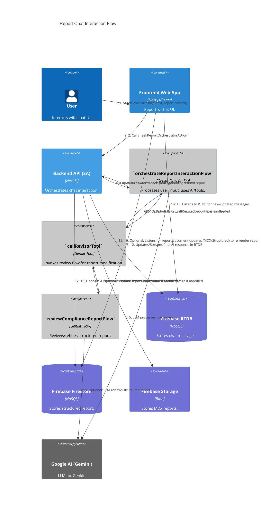

# C4 Dynamic Diagram: Report Chat Interaction

[<- Back to Level C4 (Code)](./index.md)

This diagram illustrates the communication flow when a user interacts with the AI agent via a report's chat interface, including the possibility of report revision.

## Flow Description

1.  The **User** sends a message via the **Frontend Web App**'s chat interface.
2.  The **Frontend** calls the `askReportOrchestratorAction` Server Action.
3.  The **Server Action** saves the user's message and an AI placeholder to **Firebase RTDB**.
4.  The **Server Action** invokes the **`orchestrateReportInteractionFlow`** (Genkit flow).
5.  The flow uses **Google AI (Gemini)** to process the query.
6.  Optionally, if report modification is requested, the flow calls the **`callRevisorTool`**.
7.  The tool, in turn, invokes the **`reviewComplianceReportFlow`**.
8.  The review flow uses **Google AI** to refine the structured report.
9.  The revised report is returned to the tool.
10. The tool returns the revised report to the main orchestration flow.
11. The orchestration flow returns the AI's textual response and any revised report to the Server Action.
12. The **Server Action** streams/updates the AI's response in **RTDB**.
13. If the report was modified, the **Server Action** updates the structured report in **Firestore**.
14. If modified, new MDX is generated and saved to **Firebase Storage**.
15. The **Frontend** listens to **RTDB** for chat message updates.
16. The **Frontend** may also listen to **Firestore** for changes to the main report document to re-render.
