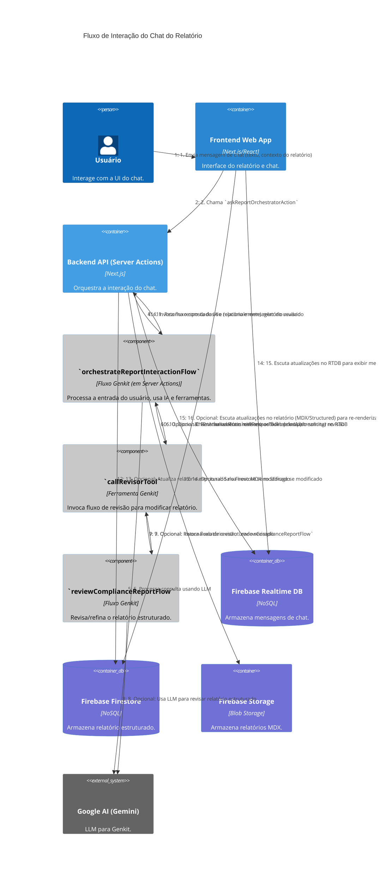

# C4 Dynamic Diagram: Interação com Chat do Relatório

[<- Voltar para Nível C4 (Código)](./index.md)

Este diagrama ilustra o fluxo de comunicação quando um usuário interage com o agente de IA através da interface de chat de um relatório, incluindo a possibilidade de revisão do relatório.

## Descrição do Fluxo

1.  O **Usuário** digita uma mensagem na interface de chat do **Frontend Web App** e a envia. A mensagem inclui o texto do usuário e o contexto do relatório atual (MDX e estruturado).
2.  O **Frontend Web App** chama a Server Action `askReportOrchestratorAction` (parte do contêiner **Backend API (Server Actions)**).
3.  A **Server Action** salva a mensagem do usuário no **Firebase Realtime Database (RTDB)** e cria um placeholder para a futura resposta da IA.
4.  A **Server Action** invoca o fluxo Genkit **`orchestrateReportInteractionFlow`** (um componente dentro das Server Actions), passando a mensagem do usuário e o contexto do relatório.
5.  O **`orchestrateReportInteractionFlow`** usa o **Google AI (Gemini)** para entender a consulta do usuário.
6.  **Opcional:** Se o usuário solicitar uma revisão ou modificação no relatório, o **`orchestrateReportInteractionFlow`** pode decidir usar a ferramenta Genkit **`callRevisorTool`**.
7.  **Opcional:** A **`callRevisorTool`** invoca outro fluxo Genkit, **`reviewComplianceReportFlow`**.
8.  **Opcional:** O **`reviewComplianceReportFlow`** usa o **Google AI (Gemini)** para revisar e refinar o relatório estruturado (JSON).
9.  **Opcional:** O relatório estruturado revisado é retornado pela **`reviewComplianceReportFlow`** para a **`callRevisorTool`**.
10. **Opcional:** A **`callRevisorTool`** retorna o relatório revisado ao **`orchestrateReportInteractionFlow`**.
11. O **`orchestrateReportInteractionFlow`** formula a resposta final para o usuário (e inclui o relatório revisado, se houver) e a retorna para a **Server Action**.
12. A **Server Action** transmite a resposta da IA (potencialmente em chunks) para o **Firebase Realtime Database**, atualizando o placeholder criado anteriormente.
13. **Opcional:** Se o relatório foi modificado, a **Server Action** atualiza o relatório estruturado (JSON) no **Firebase Firestore**.
14. **Opcional:** Se o relatório foi modificado, a **Server Action** gera um novo MDX e o salva no **Firebase Storage**.
15. O **Frontend Web App** escuta as atualizações no **Firebase Realtime Database** e exibe as novas mensagens (do usuário e da IA) em tempo real.
16. **Opcional:** O **Frontend Web App** também pode escutar alterações no documento do **Firebase Firestore** (para o relatório estruturado e caminho do MDX) e atualizar a visualização do relatório se ele for modificado pela IA.

Este diagrama destaca a colaboração entre o frontend, as server actions, os fluxos Genkit e os serviços Firebase para fornecer uma experiência de chat interativa.
