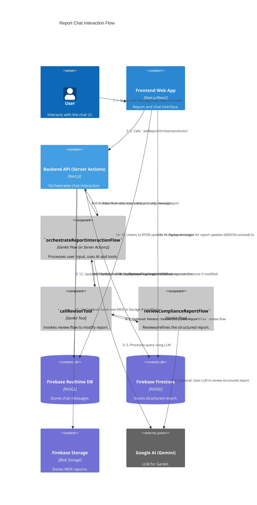

# C4 Dynamic Diagram: Report Chat Interaction

[<- Back to Level C4 (Code)](./index.md)

This diagram illustrates the communication flow when a user interacts with the AI agent via a report's chat interface, including the possibility of report revision.

## Flow Description

1.  The **User** types a message in the **Frontend Web App**'s chat interface and sends it. The message includes user text and the current report context (MDX and structured).
2.  The **Frontend Web App** calls the `askReportOrchestratorAction` Server Action (part of the **Backend API (Server Actions)** container).
3.  The **Server Action** saves the user's message to **Firebase Realtime Database (RTDB)** and creates a placeholder for the future AI response.
4.  The **Server Action** invokes the Genkit flow **`orchestrateReportInteractionFlow`** (a component within Server Actions), passing the user message and report context.
5.  The **`orchestrateReportInteractionFlow`** uses **Google AI (Gemini)** to understand the user's query.
6.  **Optional:** If the user requests a review or modification of the report, **`orchestrateReportInteractionFlow`** may decide to use the Genkit tool **`callRevisorTool`**.
7.  **Optional:** The **`callRevisorTool`** invokes another Genkit flow, **`reviewComplianceReportFlow`**.
8.  **Optional:** The **`reviewComplianceReportFlow`** uses **Google AI (Gemini)** to review and refine the structured report (JSON).
9.  **Optional:** The revised structured report is returned by **`reviewComplianceReportFlow`** to **`callRevisorTool`**.
10. **Optional:** The **`callRevisorTool`** returns the revised report to **`orchestrateReportInteractionFlow`**.
11. The **`orchestrateReportInteractionFlow`** formulates the final response for the user (and includes the revised report, if any) and returns it to the **Server Action**.
12. The **Server Action** streams the AI's response (potentially in chunks) to **Firebase Realtime Database**, updating the previously created placeholder.
13. **Optional:** If the report was modified, the **Server Action** updates the structured report (JSON) in **Firebase Firestore**.
14. **Optional:** If the report was modified, the **Server Action** generates new MDX and saves it to **Firebase Storage**.
15. The **Frontend Web App** listens to updates in **Firebase Realtime Database** and displays new messages (from user and AI) in real time.
16. **Optional:** The **Frontend Web App** can also listen for changes in the **Firebase Firestore** document (for the structured report and MDX path) and update the report view if it's modified by the AI.

This diagram highlights the collaboration between the frontend, server actions, Genkit flows, and Firebase services to provide an interactive chat experience.

    